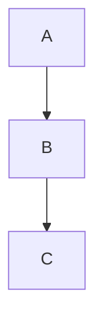

# Markdown 解析器覆盖 & 边界测试语料

> 用途:把本文件整体或分段喂给你的 editor/reader,逐节对照渲染结果。
> 每节标题说明它测什么。任何一节渲染错乱 / 崩溃 / 卡死都记为一个 finding。
> 真正 fuzz 时建议用配套脚本把每个用例拆成独立文件,避免一个坏构造污染后续。

---

## 1. CommonMark 核心

### 1.1 ATX 标题

# H1
## H2
### H3
#### H4
##### H5
###### H6
####### 7 个井号(不是标题,应作段落)
#no-space(无空格,CommonMark 里不是标题)
### 结尾井号 ###
### 结尾井号带空格 #####  
#	Tab 分隔的标题

### 1.2 Setext 标题

一级标题
===========

二级标题
-----------

多行段落
第二行
下面的等号只对最后一段生效?
===

### 1.3 段落 & 软/硬换行

普通段落第一行
普通段落第二行(软换行)

行尾两空格硬换行  
下一行

反斜杠硬换行\
下一行

行尾一个空格 
不构成硬换行

### 1.4 引用块(含嵌套 & lazy continuation)

> 一级引用
> > 二级引用
> > > 三级引用

> lazy continuation
第二行没有 > 前缀

> 引用里放列表
> - a
> - b
>
> > 引用里放引用里放代码
> > ```
> > code
> > ```

### 1.5 列表(有序 / 无序 / 松散 / 紧凑 / 嵌套)

- a
- b
- c

* 星号项
+ 加号项
- 减号项(三种 marker 混用应分成多个列表)

1. one
2. two
3. three

3. 起始编号非 1
4. 应保留起始 3
5. 

1) 圆括号 marker
2) 第二项

0. 起始编号 0
10000000. 超大编号

- 松散列表(项间有空行)

- 第二项

- 紧凑列表
- 无空行

1. 嵌套
   1. 子项(3 空格缩进)
   2. 子项
      - 更深
        - 再深
2. 回到顶层

- 列表项里放多段
  第二段需要缩进对齐

  真正的第二段

### 1.6 代码块

    缩进代码块(4 空格)
    第二行
        更深缩进保留

```
围栏代码块(反引号)
*不解析* 里面的标记
```

~~~
围栏代码块(波浪号)
~~~

```python
def f(x):
    return x * 2   # 带 info string
```

```````
7 个反引号围栏,内部可含 3~6 个反引号 ```
```````

``` 带尾随空格的 info string   
code
```

无闭合的围栏代码块(应吃到文末)
```
never closed

### 1.7 行内代码

`inline`
`` 含反引号 ` 的行内代码 ``
``` 三反引号行内 ``` 
`` ` `` (单独一个反引号)
`空格 trim  `
`未闭合的行内代码
`a``b`(相邻)

### 1.8 强调 / 加粗(CommonMark 强调规则重灾区)

*em* _em_
**strong** __strong__
***both*** ___both___
*foo**bar**baz*
**foo*bar*baz**
*foo __bar__ baz*
a * b * c(带空格不成强调)
foo*bar*baz(词内下划线? 星号可)
foo_bar_baz(词内下划线不成强调)
**foo bar**
** foo bar **(内侧空格,不成)
*(*foo*)*
*foo*bar*
***foo*bar**
foo____bar____baz
*a *b *c* d* e*(未平衡嵌套)
_a_b_c_d_
****(纯 4 星号)
______(纯下划线)
`code with * asterisk *`
\*escaped not em\*

### 1.9 链接

[inline](http://example.com)
[inline title](http://example.com "标题")
[带尖括号](<http://example.com/with space>)
[reference][ref]
[collapsed][]
[shortcut]
[大小写不敏感的 ref][REF]

[ref]: http://example.com/ref "ref title"
[collapsed]: http://example.com/collapsed
[shortcut]: http://example.com/shortcut

<http://autolink.example.com>
<mailto:user@example.com>
<user@example.com>

[未定义的引用][nope]
[嵌套 [方括号] 文本](http://x.com)
[a[b](c)d](e)(链接嵌套)
[空 URL]()
[](空文本)
[反斜杠 \] 转义](http://x.com)
[url 含括号](http://x.com/foo(bar))
[url 含括号未转义](http://x.com/foo)bar)

### 1.10 图片


![ref image][img]

[](http://x.com)

[img]: http://example.com/img.png

### 1.11 分割线

---
***
___
- - -
* * *
_ _ _
--------------------
 ---  (前置空格 ≤3)
    ---(4 空格,是代码块不是分割线)

### 1.12 内联 HTML / HTML 块

<div class="raw">HTML 块</div>

<span>inline html</span> 混在文本里

<!-- HTML 注释 -->

<script>alert('是否被消毒?')</script>

(XSS 向量,检查是否转义)

<a href="javascript:alert(1)">js 协议</a>

<unclosed tag

<TABLE><TR><TD>大写标签</TD></TR></TABLE>

<?php echo "processing instruction"; ?>

<![CDATA[ cdata ]]>

### 1.13 转义 & 实体

\* \_ \` \# \[ \] \( \) \{ \} \! \\ \+ \- \. \>
\a \空格(非可转义字符,反斜杠保留)
&amp; &lt; &gt; &quot; &nbsp;
&#65; &#x41; &#X41;
&#0;(空字符实体)
&#xFFFFFF;(超范围码点)
&notarealentity;
&#;(空数字实体)

---

## 2. GFM 扩展

### 2.1 表格

| 左 | 中 | 右 |
|:---|:--:|---:|
| a  | b  | c  |
| 长长长长长内容 | x | y |

无外边框表格
Col1 | Col2
--- | ---
1 | 2

| 列数不匹配 | 只有两列的表头 |
| --- | --- |
| 但这行 | 有 | 三列 |
| 这行 | 只一列 |

| 转义竖线 \| 在单元格 | 正常 |
| --- | --- |
| a \| b | c |

|单侧竖线
|---
|值

### 2.2 删除线

~~strikethrough~~
~single tilde 不是 GFM 删除线~
~~未闭合删除线
~~含 *强调* 的删除~~

### 2.3 任务列表

- [ ] 未完成
- [x] 已完成
- [X] 大写 X
- [] 无空格(不是任务项?)
- [ ] 带子项
  - [ ] 子任务

### 2.4 自动链接扩展

裸 URL http://example.com 应自动链接
www.example.com 无协议
邮箱 user@example.com 自动链接
http://例子.测试(IDN / Unicode 域名)
http://example.com/path?a=1&b=2#frag 带参数
链接结尾标点 http://example.com. 句号是否算入

### 2.5 脚注(GFM / 扩展)

正文引用脚注[^1] 和另一个[^long]。

[^1]: 脚注内容。
[^long]: 多段脚注。

    缩进的第二段。

[^未定义]: 定义了但没引用。

---

## 3. 常见扩展语法(视实现而定)

### 3.1 数学

行内公式 $a^2 + b^2 = c^2$ 结束。
$$
\int_0^\infty e^{-x} dx = 1
$$
未闭合 $行内
转义 \$ 不是公式
$含 *星号* 与 \\ 反斜杠$

### 3.2 高亮 / 上下标

==高亮文本==
H~2~O 下标
X^2^ 上标
==未闭合高亮

### 3.3 定义列表

术语
: 定义 1
: 定义 2

### 3.4 Admonition / Callout

> [!NOTE]
> 提示框

> [!WARNING]
> 警告框

:::note
容器式 callout
:::

### 3.5 Front matter

<!-- 注意:front matter 必须在文件最开头才有效,此处仅测试鲁棒性 -->
---
title: 测试
tags: [a, b]
---

### 3.6 Emoji / 短代码

:smile: :rocket: :+1:
:未知短代码:
👍 直接 emoji
👨‍👩‍👧‍👦 ZWJ 组合 emoji

### 3.7 带语言的代码围栏(渲染器扩展)



```mermaid
非法 mermaid 语法 !!!@#$
```

```diff
+ added
- removed
```

---

## 4. 对抗性 / 边界用例(fuzz 重点)

### 4.1 深度嵌套(栈溢出 / 性能)

> > > > > > > > > > > > > > > > > > > > 二十层引用嵌套

- - - - - - - - - - 十层列表标记

[[[[[[[[[[ 十层未闭合方括号

(((((((((( 十层括号

*_*_*_*_*_*_*_*_*_*_ 交替强调标记

### 4.2 未平衡 / 未闭合分隔符

*a *b *c *d *e *f *g(多个未闭合星号)
`a `b `c `d(多个未闭合反引号)
[a [b [c [d(多个未闭合方括号)
<a><b><c(多个未闭合标签)

### 4.3 ReDoS / 灾难性回溯诱饵

aaaaaaaaaaaaaaaaaaaaaaaaaaaaaa*(长串 + 悬挂标记)
[a](a][a](a][a](a][a](a][a](a][a](a]
****************************************(纯分隔符长串)
> a
> a
> a
> a
(大量单行引用,考验行级性能)

### 4.4 空白字符处理

	Tab 开头(制表符是否按 4 列展开)
 	混合空格 Tab
一行末尾多个空格          
段落中间的	Tab	字符
	- Tab 缩进的列表项

### 4.5 行尾符 & BOM

第一行 LF
第二行 CRLF(见二进制脚本)
只有 CR 换行(见二进制脚本)
混合行尾(见二进制脚本)

### 4.6 Unicode 边界

零宽空格​在此(U+200B)
零宽连接符‌‍在此
不换行空格 A B(U+00A0)
组合字符 é vs é(NFC vs NFD)
全角标点 ！？【】《》
从右向左文本 مرحبا 混排 hello
BiDi 覆盖攻击(Trojan Source,见二进制脚本)
代理项 / 超 BMP 码点 𝕳𝖊𝖑𝖑𝖔 𝓦𝓸𝓻𝓵𝓭
同形字域名 http://аpple.com(西里尔 а)

### 4.7 混合 / 交错构造

# 标题里有 `代码` 和 *强调* 和 [链接](x)
> - 引用里的列表里的 **加粗** 和 `代码`
1. 有序列表里的表格
   | a | b |
   | --- | --- |
   | 1 | 2 |
- [ ] 任务项里的 ~~删除线~~ 和 [链接](x) 和 ==高亮==

行内混杂 ***`code`*** **_[link](x)_** ~~*em*~~

### 4.8 极端规模

单行超长(见二进制脚本可生成 100KB 单行)
超多引用定义(见脚本)
超深单条列表嵌套(见脚本)

### 4.9 空 / 退化输入


(上面是空行开头)
   
(仅空白的文件片段)

---

## 5. 往返一致性检查点(property: parse→render→parse 应稳定)

以下构造用于测试「渲染后再解析是否语义漂移」:

*已经强调过的* 文本
`已经代码过的`
[已解析链接](http://x.com)
- 已解析列表

<!-- 结束 -->
